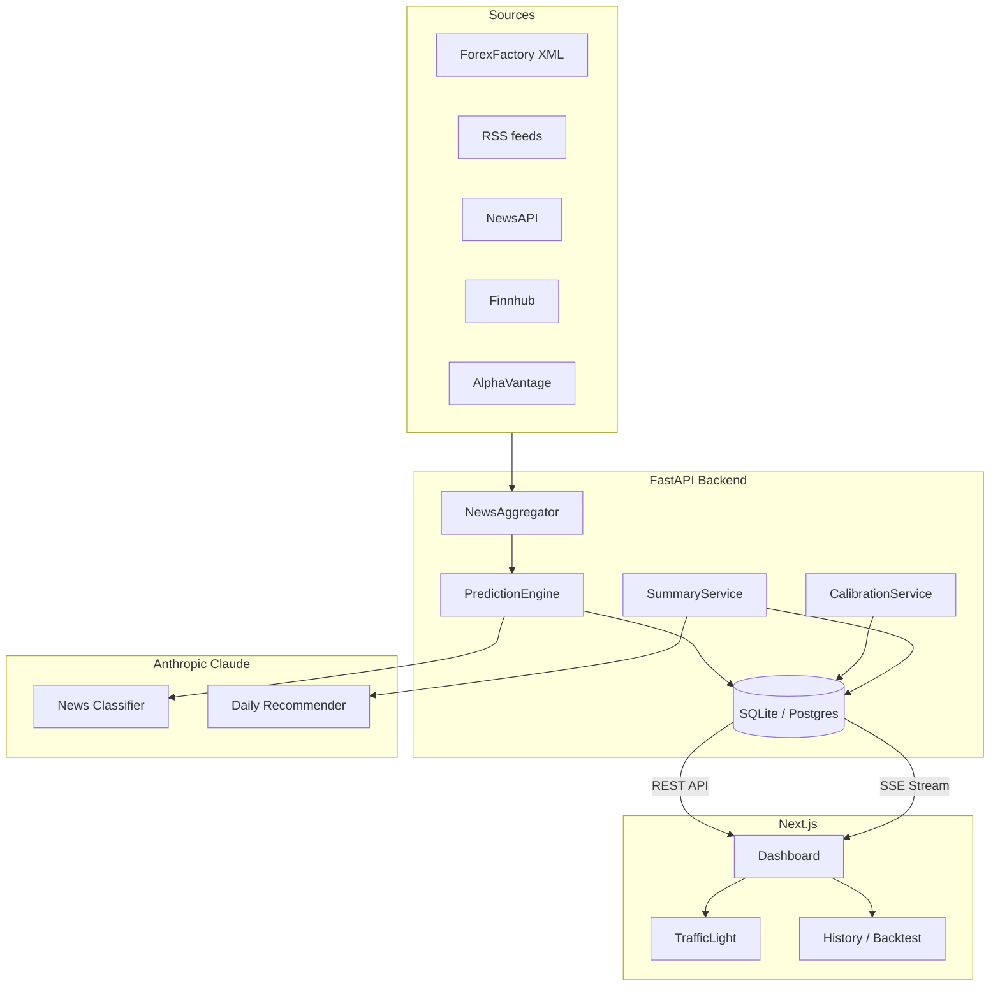

# Tradezer — News Impact Trading Agent

Real-time forex news aggregator s AI-powered market impact predikcí pro EUR/USD a další měnové páry.

## Architektura



## Rychlý start (lokální dev)

### Prerekvizity
- Python 3.11+
- Node.js 20+

### 1. Klony a nastavení

```bash
git clone <repo>
cd news-impact-agent
cp .env.example .env
# Edituj .env — minimum: nastav ANTHROPIC_API_KEY
```

### 2. Backend

```bash
cd api
pip install -r requirements.txt
# Vytvoří DB + spustí seed s demo daty
python -m app.db.seed
# Spustí backend
uvicorn app.main:app --reload --port 8000
```

API docs: http://localhost:8000/docs

### 3. Frontend

```bash
cd web
npm install
npm run dev
```

Dashboard: http://localhost:3000

### Nebo Docker

```bash
cp .env.example .env
# Nastav ANTHROPIC_API_KEY v .env
docker compose up
```

## API endpointy

| Method | Endpoint | Popis |
|--------|----------|-------|
| GET | `/api/tickers` | Seznam aktivních tickerů |
| GET | `/api/news?ticker=EURUSD&limit=25` | Feed zpráv s predikcemi |
| GET | `/api/news/{id}` | Detail zprávy + reasoning |
| GET | `/api/summary/daily?ticker=EURUSD` | Denní souhrnná predikce |
| GET | `/api/history?ticker=EURUSD&days=90` | Historická přesnost |
| GET | `/api/stream?ticker=EURUSD` | SSE live stream |
| POST | `/api/refresh` | Manuální fetch (vyžaduje `X-Internal-Token`) |
| GET | `/api/health` | Health check |

## Jak funguje predikce

1. **LLM klasifikace** — Claude analyzuje zprávu a vrátí JSON s `prob_down/neutral/up`
2. **Historická korelace** — pro nalezené kategorie zpráv se spočítá empirická distribuce z `market_reactions`
3. **Bayesovská kombinace** — `final = α·llm + (1-α)·hist`, kde `α` klesá jak přibývají historická data (0.7 → 0.3)
4. **Daily summary** — vážený průměr všech dnešních zpráv → textové doporučení

## Konfigurace

| Env var | Default | Popis |
|---------|---------|-------|
| `ANTHROPIC_API_KEY` | — | Povinné pro LLM |
| `DATABASE_URL` | `sqlite+aiosqlite:///./local.db` | SQLite lokálně, Postgres v produkci |
| `NEUTRAL_THRESHOLD_EURUSD` | `0.002` | ±0.2% pro EUR/USD neutral zónu |
| `REFRESH_INTERVAL_MINUTES` | `5` | Jak často se fetchují zprávy |
| `INTERNAL_API_TOKEN` | — | Token pro `/api/refresh` |

## Deploy na Vercel

### Backend (Python serverless)

```bash
cd api
vercel deploy
# Nastav env vars v Vercel dashboard:
# - ANTHROPIC_API_KEY
# - DATABASE_URL (Vercel Postgres / Neon connection string)
# - INTERNAL_API_TOKEN
```

### Frontend (Next.js)

```bash
cd web
vercel deploy
# Nastav env var:
# - NEXT_PUBLIC_API_URL=https://your-api.vercel.app
```

### SQLite → Postgres migrace

```bash
# 1. Nastav DATABASE_URL na postgres:// connection string
# 2. Spusť Alembic migrace
cd api
alembic upgrade head
# 3. Volitelně: přenes data
python -m app.db.seed  # znovu naseeduje demo data
```

## Testy

```bash
# Backend
cd api && pytest tests/ -v

# Frontend
cd web && npm test
```

## Struktura projektu

```
news-impact-agent/
├── api/                    # FastAPI backend
│   ├── app/
│   │   ├── main.py         # FastAPI app + lifespan
│   │   ├── config.py       # Nastavení přes env vars
│   │   ├── db/             # Engine, session, seed
│   │   ├── models/         # SQLAlchemy modely
│   │   ├── schemas/        # Pydantic v2 schémata
│   │   ├── repositories/   # DB přístup (repository pattern)
│   │   ├── services/       # Business logika
│   │   ├── sources/        # News adaptéry (ABC + implementace)
│   │   ├── llm/            # Claude client + prompty
│   │   └── jobs/           # APScheduler
│   └── tests/
├── web/                    # Next.js 14 frontend
│   ├── app/                # App Router stránky
│   ├── components/         # TrafficLight, NewsCard, ...
│   └── lib/                # API client, utils
├── docker-compose.yml
├── .env.example
└── API_KEYS_NEEDED.md
```
